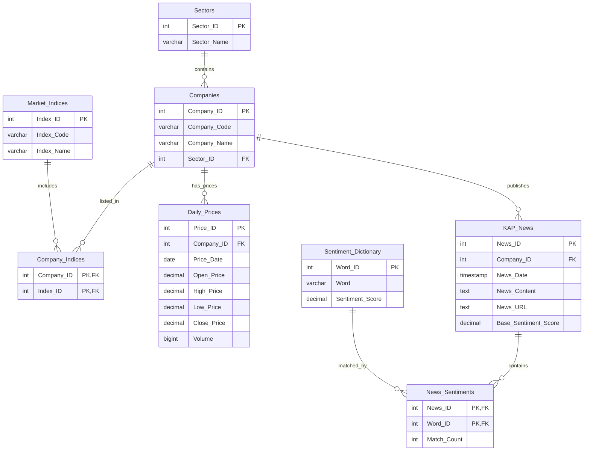

# BIST-Algo-Analyzer Final Teknik Rapor

## 1. Proje Özeti

Bu proje, Borsa İstanbul şirketlerine ait günlük fiyat verileri ile KAP duyurularını aynı ilişkisel veritabanında birleştirerek analitik sorgular üretmeyi amaçlayan bir karar destek sistemidir. Temel hedef, yatırımcının fiyat hareketi, haber yoğunluğu ve sentiment skorunu tek model içinde analiz edebilmesidir.

---

## 2. Veri Modeli ve ERD

Veritabanı 8 ana tablo üzerine kurulmuştur. Yapı, bir şirketin birden fazla indekste yer alabilmesi ve bir haberin birden fazla sentiment kelimesi içerebilmesi gibi M:N ilişkileri ara tablolarla yönetir.

### Tablo Rolleri

- `Sectors`: Şirketlerin sektör bilgisini tutar.
- `Companies`: Şirket kodu, adı ve sektör ilişkisini tutar.
- `Market_Indices`: BIST indekslerini tutar.
- `Company_Indices`: Şirketlerin birden fazla indekste yer almasını sağlar.
- `Daily_Prices`: OHLCV fiyat verisini tutar.
- `KAP_News`: Şirket bazlı resmi duyuruları tutar.
- `Sentiment_Dictionary`: Pozitif ve negatif kelime sözlüğünü tutar.
- `News_Sentiments`: Haber ile kelime eşleşmelerini tutar.

---

## 3. Normalizasyon Değerlendirmesi

Çekirdek tasarım 3NF mantığına uygundur:

- `Sectors`, `Market_Indices` ve `Sentiment_Dictionary` referans tablolar olarak ayrılmıştır.
- `Companies` tablosunda sektör bilgisi tekrar edilmez; dış anahtar ile tutulur.
- `Daily_Prices` ve `KAP_News` tabloları atomik satırlar içerir.
- `Company_Indices` ve `News_Sentiments` ara tabloları M:N ilişkileri çözer.

### Dikkat Edilen Tasarım Notu

- `Base_Sentiment_Score` alanı, analitik kullanım için tutulan kontrollü bir cache alanıdır.
- Bu alanın güncelliği `News_Sentiments` trigger'ı ve `sp_recalculate_news_sentiment` procedure'ı ile korunur.
- Böylece veri tekrarından kaynaklanabilecek tutarsızlıklar minimize edilir.

Bu nedenle proje, çekirdek ilişkisel model açısından normalleştirilmiş; analitik performans için ise kontrollü bir özet alan içerecek şekilde tasarlanmıştır.

---

## 4. PK, FK ve Index Yapısı

### Primary Key ve Foreign Key

- Her tabloda birincil anahtar tanımlanmıştır.
- Ara tablolarda bileşik PK kullanılmıştır.
- FK ilişkilerinde uygun `ON DELETE CASCADE`, `ON DELETE RESTRICT` ve `ON DELETE SET NULL` yaklaşımları kullanılmıştır.

### Performans İndeksleri

- `Companies(Sector_ID)`
- `Company_Indices(Index_ID, Company_ID)`
- `Daily_Prices(Company_ID, Price_Date DESC)`
- `Daily_Prices(Price_Date DESC)`
- `KAP_News(Company_ID, News_Date DESC)`
- `KAP_News((News_Date::date))`
- `News_Sentiments(Word_ID)`

Bu indeksler, özellikle zaman serisi, haber eşleştirme ve sektör bazlı analiz sorgularını hızlandırmak için eklendi.

---

## 5. Final SQL Bileşenleri

### 5.1 View'lar

#### `Firsat_Hisseleri_View`

- Pozitif sentiment skoruna sahip günleri şirket fiyatı ve hacmi ile birlikte listeler.
- JOIN, LEFT JOIN, GROUP BY, HAVING ve aggregate fonksiyonları kullanır.

#### `Sektor_Risk_Ozeti_View`

- Sektör bazında şirket sayısını, haber yoğunluğunu, ortalama kapanış fiyatını ve negatif kelime sayısını özetler.
- Sektörler arası risk karşılaştırması için kullanılır.

### 5.2 Stored Procedure

#### `sp_recalculate_news_sentiment(p_news_id)`

- Tekil bir haberin veya tüm haberlerin sentiment skorunu yeniden hesaplar.
- Bulk import sonrası bakım operasyonu olarak kullanılabilir.

### 5.3 Trigger

#### `trg_news_sentiments_refresh_score`

- `News_Sentiments` tablosunda insert, update veya delete olduğunda ilgili haberin sentiment skorunu otomatik günceller.
- Bu mekanizma, analitik cache alanının tutarlı kalmasını sağlar.

---

## 6. Advanced SQL Senaryoları

### CTE + Window Function

- SMA-50 hesaplaması için window function kullanılmıştır.
- CTE ile fiyat ve sentiment katmanları okunabilir bloklara ayrılmıştır.

### Subquery / Correlated Subquery

- Şirketlerin son kapanış fiyatı sektör ortalaması ile karşılaştırılır.
- Son 15 gündeki haber yoğunluğu alt sorgu ile çıkarılır.

### Aggregate Analizi

- Pozitif ve negatif kelime sayıları `SUM`, `COUNT`, `AVG`, `GROUP BY` ve `HAVING` ile özetlenir.

---

## 7. Test Verisi ve Çalıştırılabilirlik

`sql/seed_data.sql` dosyası, final sorgularını çalıştırmak için yeterli örnek veri içerir:

- 8 sektör
- 5 indeks
- 10 şirket
- 80+ işlem günü fiyat verisi
- 12 KAP haberi
- 36 sentiment eşleşmesi

Bu veri yapısı:

- SMA-50 hesaplamasını,
- sektor risk özetini,
- trigger davranışını,
- procedure çalıştırmasını
test etmek için uygundur.

---

## 8. Sonuç

Bu proje, finansal zaman serisi verisi ile metin tabanlı haber duyarlılığını tek bir ilişkisel model içinde birleştirir. Final sürümünde şema tasarımı, veri bütünlüğü, performans indeksleri, ileri SQL sorguları ve otomasyon mekanizmaları bir araya getirilerek akademik final kriterlerini karşılayan bir veritabanı çözümü oluşturulmuştur.

